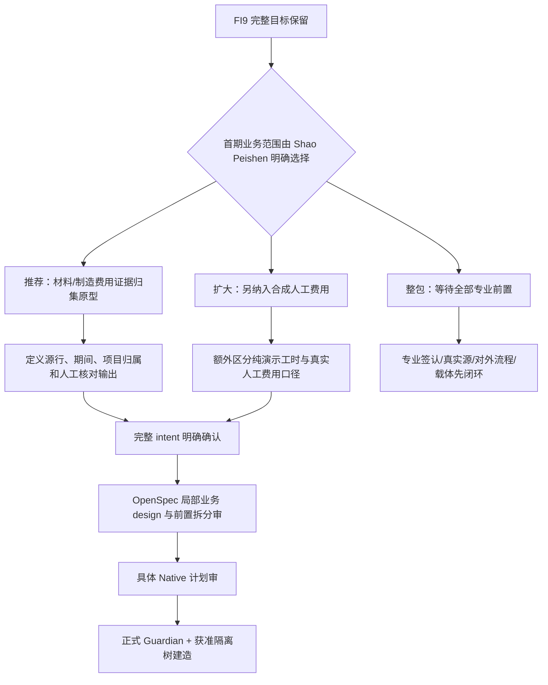

# FI9 首期范围 grill 与 M2 事实准备

## 一、这轮解决什么

将既有 FI9 全景目标拆成可审阅的首期业务范围，补存量场景的 requirement-grill。当前走**架构设计路径**：M1 决策树 → M2 可查事实 → 业务范围选择 → 完整 intent 明确确认 → OpenSpec design 审 → 具体计划审 → 正式 Guardian 与获准隔离工作树 Native 建造。

本件是 M1/M2 准备，不标 `intent status: 已确认`，也不批准原包 `tasks.md` §3–§5 开工。已提出的首期与前置拆分，须 Shao Peishen 明确答复；等待时间不构成批准。

长期业务目标继续保留：U9C 项目材料/人工/制造费用采集，资本化/费用化建议，高新辅助账及研发费用占比，加计扣除备查材料、政府专项核算、项目投入产出分析。原场景为 L2，财务/研发总监审核确认。首期范围选择只决定先交付什么。

## 二、M2 自查事实

### 2.1 工程和批准边界

| 项目 | 现时事实 | 对下一步的影响 |
|---|---|---|
| 正确工程目录 | `4-数字员工/财务部/FI9-研发费用归集与高新认定/` | 使用此正本；不沿用猜测目录 |
| 正确变更包 | `openspec/changes/fi9-rd-cost-mvp/` | 已有 proposal、局部 design、tasks、三份 delta specs |
| 完整 intent | 2026-10-03T14:11:40Z 的命名源核验：该场景 `intent.md` 不存在 | 存量补 grill 尚未收工；不能新增 proposal 绕过 intent 闸 |
| 局部 design | 只覆盖 EE-3/OEM 接法，五项裁决已批 | 沿用五项，不重问；不推成整个 FI9 design 批准 |
| 业务引擎 | `tasks.md` §3–§5 均未完成；§2 未全部关闭，不得进入 §3 | 本轮只准备文档，不实现归集/判定/申报 |
| 现有骨架 | 五个数据契约、三个判据声明、OEM 隔离组件、三张合成 CSV | 数据形状与组件存在，不能证明真实源或业务引擎存在 |
| 历史测试 | 官方 #473 留有 38 FI9/466 平台等历史记录 | 仅为历史；本轮未运行任何产品测试，不作为当前 HEAD 测试证据 |
| 日期 | 全景与实施计划当前 FI9 为 D 档、前置到位后 8 天；旧 2027-06 是历史排期 | 日期排序不阻挡准备；真实前置和批准门槛仍成立 |
| 前置总表 | 当前版本对 `FI9` 的精确搜索未命中 | 只说明此表未见该行，不能推成项目没有任何前置或负责人 |

### 2.2 沿用的五项 OEM 裁决

1. 项目/成本/工时明细严格按 OEM 隔离；匿名汇总按现行规范 §2.3 的脱敏、签字、audit 路径。
2. 法定申报可走拟议的限定用途、限定流向、审计与人工外发三道锁；**跨 OEM 汇总须先将豁免正式立入规范**。
3. `oem_customer=None` 表示未判，允许保留归集明细，禁止进入任何汇总和对外产物，显要列出被排除项目。
4. 归属由研发侧项目主数据认定，财务侧只读使用；不得从项目编号/名称推导。
5. 关系型取数调用 `OEMRouter.resolve()`；不把 Chroma 唯一入口机械套到关系型取数。

M2 子代理显式使用 `gpt-6-luna`，只读检查规范、待批草案及隔离模块。核验结论：

- 现行《OEM 数据隔离规范》SHA `81957b55e3a4b912ffab8d1bb07ec0beca806bec1364b454827729adb9f45697`，未见 FI9 法定申报豁免条文或 `3.13` 条款。精确检索只对该文件作结论。
- 草案 SHA `e3d6112f6b4fef2d161d43322dfe14d129522e19c439fc9e1f776bfa9fec162d`，frontmatter 仍为 `待批`，明确不是规范本体，等待 #466 收口后合并修订。
- 模块 SHA `eece3da077be535a03a4fc1a80ebb7ded4cfa4499376eef2455dfae37fc2cd08`，有项目归属入口、按归属分组及跨 OEM 申报门。未实际接入完整业务引擎。
- 父会话只读配置证实默认关闭的实现；**未查询现场环境，不能声称现场实际 OFF/ON**。本轮不改开关或规范。

### 2.3 专业判据、事实与既有跟进分别处理

| 项目 | 当前证据 | 承接方式 |
|---|---|---|
| `CAPITALIZATION_CRITERIA` | 注册表声明，未签认 | 财务/研发专业签认；财务 #20 附件 FI9-01 已列问题 |
| `HIGH_TECH_POLICY_LIBRARY` | 注册表声明，未签认 | 财务/研发签认政策版本、范围与格式；附件 FI9-02 已列问题 |
| `RD_RATIO_DEFINITION` | 注册表声明，未签认 | 准则/高新口径分别签认；附件 FI9-03 已列分母问题 |
| 工时单价 `LaborRecord.rate` | `None`，不属于上述三个 registry 声明 | 财务/研发另行签认；不默认薪酬、分摊率或行业值 |
| 工时系统有无/维护者/导出 | `TIMESHEET_SYSTEM_EXISTS=None`；官方 #477 三项仍未核实 | 事实核验，不当口径签认；附件 FI9-工时系统已有问题 |
| U9C 项目成本真实通道 | 配置仍写通道未核实；未见本轮真实取数证据 | 真实模式接入前验证字段、身份、归属及可追溯性；不回退 mock |
| OEM 项目归属 | 骨架字段三态；未见真实研发主数据签认 | 真实接入只用研发侧已确认字段；禁止自行推导 |
| 发票对碰 | 模型载有字面一致性实测前置 | 真要对碰时实测两端；不直接继承 FI2 后 8 位方式 |

财务 #20 附件 §六已列三个专业口径与工时系统事实。正文材料第 11 项索取现行资本性/费用性政策；未见其已经索取全部 FI9 项目成本、历史申报或工时材料的证据。

当前官方跟进闸：财务 #20 `SENT`、在途，发送时刻 2026-09-23 01:02 UTC；源文件 frontmatter 的旧“待你审”已被更晚发送事实覆盖，不重发、不另占 #21。IT #13 已闭环，下一可用号是 #14；**可用号不等于已起草或已发送 IT #14**。全景中提到 IT14 的排期指针不能替代发送与回件证据。本轮不出新信、不向他人发送。

## 三、M1 决策树与当前前沿

首项选择影响后续输出与验收；实现方现在不代选。此轮异步题与本节一致，未获答复前停在范围准备。

### 3.1 方案比较

| 方案 | 首期产物 | 可先解除什么 | 增加的前置/代价 |
|---|---|---|---|
| A：证据归集试点（推荐） | 单项目、单客户、明确期间的材料/制造费用源行对照与归集原型 | 先验证“数字从哪里来、哪些源行缺证据、怎样供人工核对” | 需要明确批准首期范围及原整包前置拆分；不构成高新/税务合规结论 |
| B：另纳入合成人工费用 | A 加合成工时到人工费用的演示链 | 较早暴露人工费用输入契约与缺值路径 | 须明确这是纯合成演示；真实有无工时系统、工时单价、替代分摊方式仍未解决；不能用演示结果回填真实政策 |
| C：整包前置先闭环 | 直接按原三 capability 完整建造 | 统一覆盖采集、判定、辅助账与申报 | 工时/三判据加单价/对外流程/载体/持有人/黄金集等原前置全部先审齐；准备可以继续，产品建造等待 |

建议 A：没有已签认的财务政策或工时数据时，源行对照的最小价值可独立审阅；先分清“算到了”和“可以按某法规归入研发费用”。这只是推荐，尚未批准。

### 3.2 推荐 A 的待确认业务边界

以下均为设计讨论输入，不能当现有功能：

| 维度 | 推荐首期边界 |
|---|---|
| 输入 | 明确标为合成的项目主数据及材料/制造费用源行；单项目、单 OEM 归属、一个明确期间、明确源快照/版本 |
| 归集 | 仅对输入声明的费用类型和期间核对源行与金额；不宣称其满足高新纳入或资本化条件 |
| 归属 | 项目归属字段明确提供并按既有 OEM 组件限制；未判、未知/冲突归属、跨客户请求单独显式失败/排除，具体语义在 design 审 |
| 证据输出 | 项目/期间/费用类型、源行 ID/源单据、原金额、输入版本、是否缺证据/冲突、人工确认栏 |
| 数字核对 | 源行金额与汇总对应，可展开复核；币种、符号、精度、重复源行、跨期间处理须在 design 审具体确定，不在此设隐含默认 |
| 专业结论 | 资本化/费用化、高新范围、占比及政策版本保持未签认状态；不生成可提交申报辅助账或纳税结论 |
| 人工处理 | 财务/研发审核角色沿用全景的 L2 方向；具体权限、持有人与 backup 不从人名推导，后续按真实岗位确认 |
| 审计 | 后续 design 明确输入哈希/构建版本/行为与结果/人工修改留痕；专业规则版本与原始证据版本分别表达，不能用未签认版本充当已签结论 |
| 接入 | mock 明示；真实源未核实 fail-loud；独立后端按统一门户 `/finance/fi9` 接入，auth 设计先审，不新监听 |

### 3.3 试点验收问题（尚未签认）

1. 业务审阅者能否从一条归集结果找到全部对应源行、源快照和金额？
2. 重复行、缺少源单据、期间冲突、项目归属未判，是否能在审阅时看见并留在人工处理路径？
3. 合成示例与真实材料是否有明确、不可误读的来源标记？
4. 是否始终无法把此原型输出当成已签资本化、高新辅助账或对外申报材料？
5. 单客户数据是否保持隔离，未判项目是否未进入汇总，跨 OEM 汇总是否仍受正式规范前置约束？

这是验收问题草案，不是已经运行的测试。具体判断规则、失败边界及样例输出须随完整 intent/design 审明确；当前没有专业标准答案。

## 四、批准与前置拆分的准确落点

| 类别 | 已存在的批准/事实 | 本轮状态 |
|---|---|---|
| Native 执行方式 | Shao Peishen 已选择当前 Native；派生任务只用显式 Luna | 沿用，不重问 |
| 五项 OEM 接法 | 已批且隔离组件已存在 | 沿用，实际业务接入尚未完成 |
| 首期 A/B/C 范围 | 未在已读历史/源件中选定 | 等本轮明确业务选择 |
| mock/真实前置拆分 | 原 tasks 仍要求 §2 全部关闭后进入 §3 | 新拆分尚未批准，不能靠 mock 名称跳过原闸 |
| 完整 intent | 尚缺 | 范围答复后整理三节正式 intent，完整意图明确确认后才能 propose |
| 业务 design / 具体计划 | 当前只有局部 OEM design | 完整 intent 后逐节设计审、计划审；不把本件当批准的 code plan |
| 对外豁免规范 | 草案待批，规范本体未见对应条文 | 不改规范，不开跨 OEM 汇总 |
| 专业判据 | 三 registry 未签，工时单价未签；事实有无工时另核 | 不设默认值，不由实现方代签 |
| 实际建造与发布 | 当前未启动业务实现 | 正式 Guardian + 获准隔离树；ff、真实外发、生产部署、L2 保留逐项授权 |

本轮 async 题只定首期范围和前置拆分的方向；完整 intent 与技术 design 仍须给可审阅的具体文档。没有新的实际建造批准。

## 五、专业前置的消费路线

1. **财务 #20 已有问题**：保持现有发送链，等待专业签认/回件；不把在途当已答，不另发同题。
2. **#477 工时事实**：现有接口和合成模型只能证明契约形状。维护者/导出权限/可用字段仍由事实核验解除；有无系统与分摊政策各有不同证据。
3. **财务/研发共同专业签认**：三 registry 与工时单价分列，使用判例批改与来源条款；持有人与 backup 指定后才登记前置总表。不能从已有财务角色直接推出研发持有人。
4. **对外流程与资料载体**：原 tasks 2.3/2.5 仍开放。未来设计可比较受控材料存储与 Git 中脱敏索引/哈希/版本/audit，但现在没有批准的选择，也不把真实申报件直接写进 Git。
5. **LLM 黄金集**：只有资本化判定设计实际引入 LLM 时，使用历史通过申报输入与专家认可输出并冻结版本；无历史样本不凭模型输出自造专业答案。
6. **OEM 正式修订**：既有 #466/#374 收口链与草案审另走原任务；本件不抢其触碰区，不建立第二套豁免来源。

## 六、grill 计数口径与下游

| 项目 | 本轮可确证 | 未计入的内容 |
|---|---|---|
| 既有 registry 声明 | 3：资本化/高新政策/占比 | 工时系统事实不算判据；单价未在 registry 声明，单列专业点 |
| 原设计业务前置 | tasks 2.1/2.2/2.3/2.4/2.5/2.7/2.8 未闭环；2.6 已完成 | 不把一个 task 拆成未知数量的“已确认问题” |
| 本轮新批准的专业口径 | 0 | 三 registry、单价未签；方案 A 的推荐不是专业口径 |
| 当前人方前沿 | 1 个首期范围/前置拆分选择 | 金额精度、UI、资料载体和权限依赖范围选择，下一轮再具体审 |
| 最终 intent 新增点数及 a/b/c 来源归因 | 尚未结算 | M3 收工时按唯一决策点归并计数；不把事件行当实体数 |

下游顺序：明确范围答复 → 补齐该范围独立问题及技术约束 → 三节完整 intent（M2 事实/已定/待专员） → Shao Peishen 明确确认 → 现有包与新增局部业务设计边界说明 → design/具体计划审 → 正式 Guardian 隔离 Native 实施。所有专业与对外前置继续有对应承接，不因试点而自动销号。

## 七、源件与本轮执行记录

命名源 26 项，捕获时刻 **2026-10-03T14:11:40.041489+00:00**；master HEAD 前后均 `92ea99adb16dae4dae07b632495a6d5068d1c41d`。完整路径/字节/行数/SHA 与公开查询输出在当前会话忽略目录 `fi9-grill-source-bindings.json`，SHA 为 frontmatter 所列。哈希用于绑定阅读对象，不证明产品行为通过。

公开队列由工具查询：#473（场景）、#477（工时事实）、#614（财务定夺包）。本轮未通读/grep 队列真身或外置历史；未运行产品测试、未改产品代码、未建业务分支、未改变监听/生产服务、未向他人发送。本件准备完毕后按正式锁登记 §二，FI9 仍保持 open，design/intent 状态按本件首部。

本件首期范围仍待明确答复，项目全景仍未完工。
