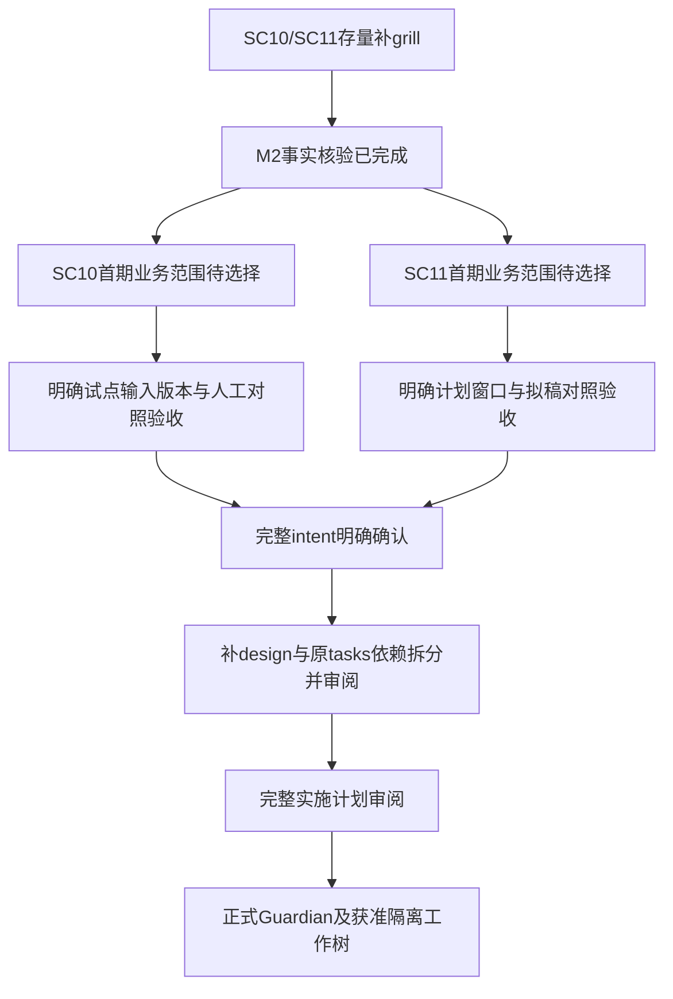

# SC10与SC11补grill · M2事实与需求树

本件仅承接 #468/#469 的存量补grill准备。两场景已有骨架、proposal/tasks/spec；缺完整 intent 和 design。当前未新建 OpenSpec、未修改产品代码、未运行产品测试。日期仅用于排序；下述真实依赖分别约束对应能力。

## 一、M2已核事实

核验手段：两名显式 gpt-6-luna 事实子代理只读场景源码/既有 tests/OpenSpec；主会话以官方工具取 #468/#469 全行，直接定位前置总表 SC10/SC11 行，并检索现存采购域口径台账。源路径与哈希见本次忽略目录 source-binding receipt。哈希捕获不等于每件由主会话全文语义审阅。

### SC10

| 对象 | 事实及来源 |
|---|---|
| 业务定位 | BOM评审及物料库管控，L2采购经理确认。骨架事实层与三类专业建议分开；《采购域场景v2.3-局部定稿》SC10块。 |
| 已有事实层 | 逐成品复用平台 explode_bom、共用料来源、主数据对齐、物料数/生命周期未知/无价/主数据缺失四计数；场景 review.py:32、agent.py:33、models.py。 |
| 缺数语义 | lifecycle缺省UNKNOWN、unit_price缺失None；不赋予枚举隐式业务排序；未选外部源调用即报缺前置。场景 CLAUDE.md §2、sources.py。 |
| 建议层 | 三个 suggest_* 保持前置阻断。外部API、价格/属性整备与 selection_ranking_criteria 是不同依赖；pending.py、proposal §知识资产三问。 |
| 可独立接入方向 | tasks 3.1–3.3列出真实ERP物料主数据只读接入，不依赖外部行情API；这不代表当前接口/样本已核实到位。当前尚无 ErpMasterSource 的交付证据。 |
| 规划缺口 | 前置总表:23仍仅两项数据型前置。tasks:27记载 EE-5=(a) 已裁定补知识型行，实际落行、Owner/打标未闭合；不重问“是否补行”。 |
| 当前验收证据 | 历史18 tests及9/29 tasks勾选是既有记录，本轮未运行测试，不能当作当前已验证。 |
| 缺件 | 场景目录无intent.md；变更包无design.md。第2组后受原design闸约束，未改变原tasks。 |

### SC11

| 对象 | 事实及来源 |
|---|---|
| 业务定位 | 库存智能调拨，L2、PMC经理确认；拟稿、ERP落库和外发具有不同闸。场景 CLAUDE.md §1/4，proposal。 |
| 已有候选计算 | 按每条demand独立列整条可满足的源仓，按显式假设顺序排序取首项。当前不拆分，不跨需求扣减已分配库存；routing.py:54/72。 |
| 共享料限制 | 当前不是跨需求全局排程；上线日期在同一条demand候选间相同，build_draft按输入需求顺序处理。这是静态读码结论，未用测试重现。 |
| 缺数与排序 | 缺分值为None且排在已知值后；未定义全部缺数必须停止。四原则齐全/优先序须显式提供，不能把调用者假设当成已签业务口径。principles.py:40/113。 |
| 确认语义 | draft可变；approve写approved_by/approved_at；现有确认未绑定内容hash/版本。执行函数仅draft入参，未确认拒绝，已确认也因通道未接抛NotWiredYet。models.py:70、gate.py:36/41。 |
| 审计范围 | run_draft记录拟稿summary与假设；SC11现有代码中未见确认动作的独立审计事件。agent.py:46；不据此推断底座或真实权限系统已失效。 |
| 规划缺口 | 前置总表:24仍三项；tasks:31已记补物流矩阵/口径行的裁决，尚未实际落行，Owner/打标及原则知识台账未闭合。 |
| 实际依赖 | 生产计划、三委外仓库存、签认原则、物流矩阵及定义均缺。ERP/外发接入仍受PMC实名确认和外发专项授权；off-LAN不能替代内网证据。 |
| 当前验收证据 | 历史22 tests和13/34 tasks勾选不是本轮执行。 |
| 缺件 | 场景目录无intent.md；变更包无design.md。未开启原tasks第3组以后。 |

### 台账核验与读取限制

主会话于2026-10-04执行 `rg -n 'SC10|SC11' '6-人才与组织/部门AI专员跟进/口径点台账/采购域.jsonl'`，退出1、stdout/stderr均无内容，表示该检索未命中；没有宣称台账全文已审阅。SC10代理另检索场景目录CriteriaRegistry/criterion无命中。当前直接可核的两场景已登记口径点数为0，已有ID未发现；不把pending依赖键当registry条目，不把专业事项总数写成0。

SC11代理的前置总表/台账读取被hook拒绝，主会话随后采用明确存在路径的普通rg定位获得上表事实；没有绕过或关闭hook。采购部直属CLAUDE.md未取得可读内容，不声称已核；部门规则以根及4-数字员工CLAUDE、实际场景CLAUDE和适用rules为准。代理Probe写共享运行时遇到权限错误，现时HEAD由主会话正式Probe与公开Git核验补足。

## 二、需求树与当前前沿

本次按brainstorming完整规格路径准备，两场景独立推进。执行方法已是当前Native，无需重选。

本轮同时询问两个互不依赖的范围问题：
1. SC10推荐“小批明确版本mock BOM/主数据的事实对照试点”，另选“公司级物料库体检”。前者先形成缺数和人工核对证据；后者资料/角色覆盖更广。
2. SC11推荐“固定周计划mock调拨拟稿试点”，另选“月中插单模拟”。前者先准备共享料占用、缺数/冲突、版本确认的对照案例；后者需同时收敛原计划与临时任务取舍。

当前两项均未收到明确答复，未记为已定；未发具备生效时刻的默认模板，本件不把经过时间当批准。范围答案只覆盖所问范围，完整intent/design/计划及专项授权各按实际阶段审阅。

## 三、专业事项分流与度量

SC10既有专业事项：选用级别因素/边界、淘汰条件、BOM评审合格线、价格与共用性/合并采购取舍。SC11既有专业事项：原则冲突顺序、“尽量少”的业务度量、距离定义、部分调拨/替代料处置、月中临时任务。来源均为既有proposal/tasks，未新增或代签阈值。Owner/backup实名与实际案例经正式专员流程确认；本件不发信，不把技术问题让Shao Peishen代答。

| 度量 | 本次准备态 |
|---|---|
| grill前registry既有 | SC10=0、SC11=0（上述可核范围）；源文非registry专业事项另列，不能混计。 |
| 新发现专业口径+归因 | 尚未完成grill，最终数量待完整需求树收敛；与人工逐格对账相关新缺口归ⓐ，既有纪律归ⓑ，真正由问答新增长才归ⓒ。 |
| 拦下数 | 本轮前沿尚未答，不虚记已拦下。代码限制/规划遗漏的发现是M2事实，不是grill问答贡献。 |

既有骨架保留，未来设计逐项证明复用、新增与受专业闸约束的能力；不重复实现现有事实层。SC11共享库存和确认版本绑定是设计待解决问题，具体接受规则/改动白名单及验证须后续批准；不以本件替代设计审或产品修复证明。

## 四、2026-10-04 当前准备更新

Shao Peishen直接指令“所有任务按计划推荐，财务域的工作暂缓，财务部场景需求可能要调整，等本次跟进信回灌再前进。”据此继续非财务推荐准备：SC10小批明确版本mock事实对照、SC11固定周计划mock拟稿。上文范围题未逐字答A的历史事实保留；本更新不把一般排序指令改写成完整intent或design批准。

两份场景intent.md均为待确认，另落《SC10与SC11首期mock对照目录-2026-10-04》：各六项对照、人工依据、既有断言/静态推论/拟新增对照身份及确认审计边界。第二轮M2确认四计数按物料ID去重、缺master不重复计缺价/未知；SC10输入模型无版次且audit hash仅计数。SC11不跨需求扣减库存、全缺评分可能按输入首项排序、确认未绑定拟稿内容。未修复这些限制，未运行产品测试。

专业占位SC10五项/SC11六项，均未入JSONL/Registry或签认；各新增一个ⓐ人工逐格对照问题（零价业务有效性/缺数输出处理），ⓒ问答净贡献各0，拦下数暂0。共享料分配先后并入既有专业事项，库存守恒/内容确认的技术问题留design，未虚报grill收敛。

接续仍为完整意图明确确认→原包design与依赖拆分→设计审→实施计划审阅→Guardian隔离建造。财务暂停及现有财务部#20回灌闸保留。直属采购CLAUDE.md读取本轮仍被K3 hook拒绝，未绕过或声称已核；使用已核根/适用rules及实际场景CLAUDE。登记精确批次B-1004_SC10SC11首期意图准备，以正常release与独立反查回执为准。
