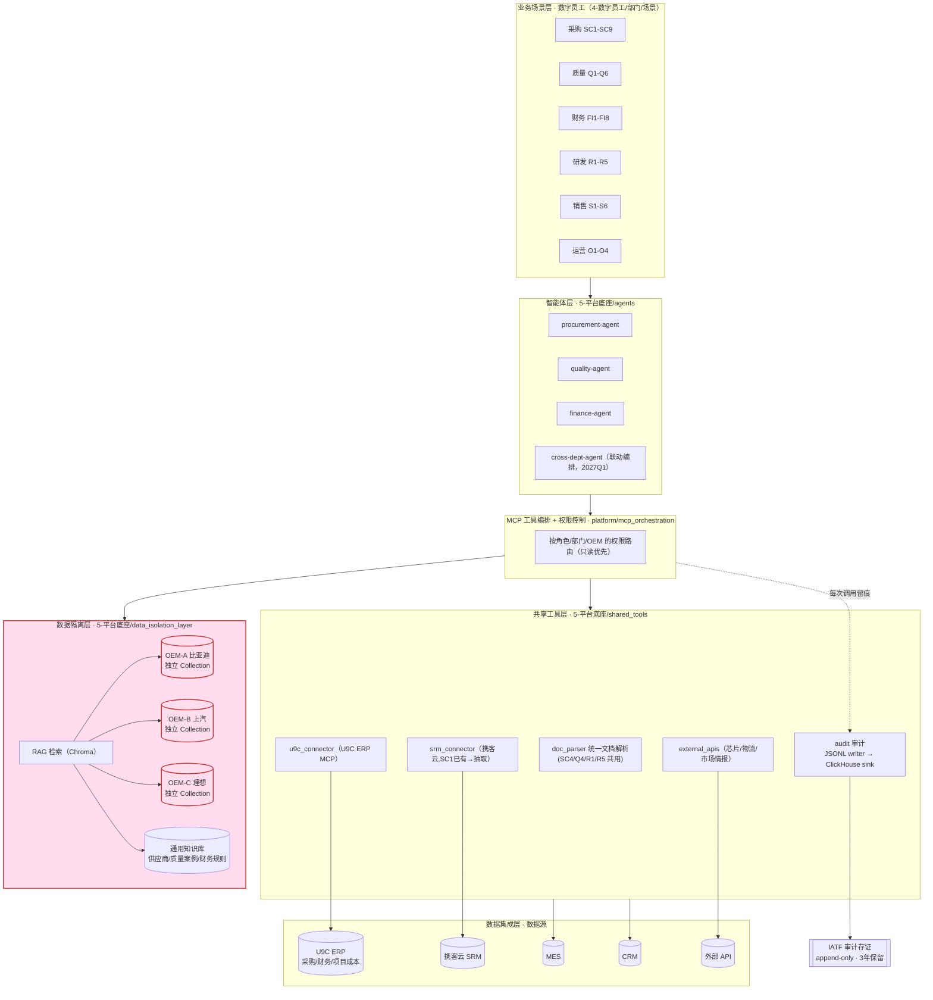
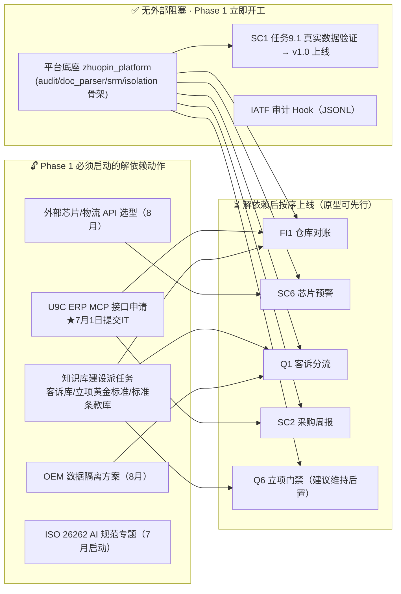

> ⚠️ **【文档状态声明（2026-06-13 追加）】本文是 2026-06-07 决策快照，其后 06-08（supplychain 收割重排）、06-11（质量域序列修订）两轮决策已推翻本文部分结论。已知过时点：**
> **① C2/§5 "Q6 维持 2027-03 后置" → 已修订为 2026-11 旗舰②提前；**
> **② §5 "SC8 维持 2027-02（依赖 SC6/SC7 稳定数据）" → SC8 已提前至 2026-07/08 收割式 MVP，不依赖 SC6/SC7；**
> **③ §1 模块图质量域 "Q1-Q6" → 现为 Q1-Q8（新增 Q7 IQC/Q8 SPC），共 40 场景。**
> **凡与《实施计划（最新版）》第七节、《全景规划》§0 修订记录、CLAUDE.md 冲突处，以后三者为准。本文其余架构结论（底座包结构、审计 JSONL→ClickHouse、依赖阻塞分析）仍有效。**
>
> 本文是 **Phase 1（基础设施与智能体构建）** 的工程落地设计草案，由首席 AI 架构师产出，供 VP 在关键节点审查。
> **本文不覆盖任何权威规划文档**——目录重构与计划改动均需 Paul 确认后再执行。

---

## 0. 先说冲突：新指令 vs 既有规划（必须先消除）

新一轮 Prompt 的**架构方向与全景规划完全一致**（MCP 跨部门框架、OEM 数据隔离、ClickHouse 审计、RAG 知识库都已写在全景规划 4.1/4.2/4.3）。需要消除的不是架构分歧，而是 **Phase 1 MVP 的范围与排序**，以及几处措辞/时序细节。

| # | 新 Prompt 表述 | 既有决策（来源） | 冲突等级 | 建议消除方案 |
|---|---------------|----------------|---------|-------------|
| C1 | 「Tier 2 供应商」 | 全景规划/记忆均为 **Tier 1**（直供比亚迪/上汽/理想） | 低（定位措辞） | 直供 OEM = Tier 1。**默认保留 Tier 1**，如卓品实际是给 Tier 1 集成商供货请纠正，我再统一全文。 |
| C2 | Phase 1 同期实现 SC6 / Q1 / Q6 / FI1 / FI2 五个新场景 | 全景时间线：FI1=9月、Q1=10月、SC6=10/12月、FI2=11月、**Q6=2027-03** | **高（排序/资源）** | 这 5 个**全部被硬依赖阻塞**（见 §4）。Phase 1 改为「平台底座 + SC1 正式上线 + 解依赖 + 对阻塞场景做原型」，真实上线仍按依赖就绪推进。**Q6 从 2027-03 提前到 Phase 1 风险最大**（依赖质量 Champion 的黄金标准库尚未建）。 |
| C3 | 「配置 ClickHouse 审计日志接口」作为 Phase 1 基建 | 审查报告遗漏6 + SC1 现状：**JSONL 先行，9月再迁 ClickHouse** | 中（时序） | 保留 **JSONL 为写入路径**（SC1 已用、零依赖、满足 IATF 当下要求），ClickHouse 作为 9 月的**汇聚 sink**。Phase 1 把审计抽象成统一接口，底层先 JSONL。 |
| C4 | 新建 `/agents` `/shared_tools` `/data_isolation_layer` 顶层目录 | 现状是 `4-数字员工/部门/场景` 各自独立 Python 工程 | 中（结构） | **不推翻现有结构**。新增 `5-平台底座/` 作为可安装 Python 包 `zhuopin_platform`，承载三类共享能力；SC1 等场景原地不动，改为 import 共享包（顺带解决 SC1↔supplychain 跨工程引用的老痛点）。见 §3。 |
| C5 | Q6「通过这些数据**训练** Agent 的敏感度」 | 全景架构为 RAG（检索增强），非微调 | 低（措辞/技术） | 此处不是「训练模型」，而是 **RAG 检索历史案例 + 规则引擎跑立项红线 + few-shot 示例**。效果等价于你说的「学会识别漏洞」，但可追溯、可解释（满足 IATF）。沿用此口径。 |
| C6 | 「Agent Teams / 派生多个 Claude 实例并行」 | SuperPowers `dispatching-parallel-agents`（P2，10-11月学习项） | 低（可用） | 工具就绪、方向对。但**真正的瓶颈不是 Claude 并行度，而是人工审查带宽（1 名 AIOps）+ 依赖就绪**。Phase 1 先用并行做「原型/测试生成」这类无需上线的工作，不强行并行上线多个生产场景。 |

> **唯一需要你拍板的关键节点**在 §6（Phase 1 MVP 范围）。其余 C1/C3/C4/C5/C6 我已给默认解法，若无异议即按此执行。

---

## 1. 系统模块设计图（Mermaid）

跨部门智能体协同框架——分层架构，红线为 OEM 数据隔离边界。



**隔离铁律**（全景规划 4.3）：查询任何涉及 OEM 技术数据的 Agent，必须在上下文显式指定客户，`data_isolation_layer` 按客户路由到对应 Collection，**禁止跨库查询**；编排层对跨 OEM 调用直接拒绝并审计。

---

## 2. Phase 1 依赖关系图（什么能现在干，什么被卡住）



要点：新 Prompt 点名的 5 个 MVP 场景**没有一个是「现在就能真上线」的**——FI1/FI2/SC2 等 U9C MCP，SC6 等外部 API，Q1/Q6 等知识库。Phase 1 的正确动作是**把平台底座建起来 + SC1 落地 + 并行解依赖**，让第二波场景一旦数据就绪即可在底座上快速成型。

---

## 3. 目录与文件清单（现状 + 建议新增）

```
企业AI转型/
├── 0-学习与工具/                         # 现有：学习路径 + 实施计划 + 审查报告
├── 1-转型规划/
│   ├── 卓品智能AI转型全景规划.md          # 权威总纲（不改）
│   └── Phase1-基础设施与智能体架构设计.md  # ← 本文（新增）
├── 2-试点项目/从采购部启动.md             # 权威路线图（不改）
├── 3-治理与合规/
│   ├── 企业AI治理清单.md
│   ├── ECU行业AI安全使用规范.md           # ← 待建（ISO26262，7月启动）
│   ├── OEM客户数据隔离技术规范.md         # ← 待建（8月）
│   └── AI错误处理与回滚SOP.md             # ← 待建（审查报告遗漏1，每场景上线前）
├── 4-数字员工/                            # 业务场景工程（保持现有布局）
│   ├── 管理模板.md  · 档案/  · 失败案例库.md（待建）
│   └── 采购部/SC1-供应商风险初筛/         # ✅ 原地不动，改为 import 平台包
│
└── 5-平台底座/  zhuopin_platform/         # ← 新增：可安装 Python 包（pip install -e）
    ├── pyproject.toml                      # 所有场景统一依赖此包，解决跨工程 import 痛点
    ├── agents/                             # 跨部门智能体逻辑
    │   ├── procurement_agent.py            # 由全局 ~/.claude/agents 抽取沉淀
    │   ├── quality_agent.py
    │   └── finance_agent.py
    ├── shared_tools/                       # 通用 MCP 工具
    │   ├── doc_parser/                     # 统一文档解析（审查报告遗漏C）
    │   ├── u9c_connector/                  # U9C ERP MCP 客户端（待接口）
    │   ├── srm_connector/                  # 携客云 SRM（从 SC1 抽取复用）
    │   ├── external_apis/                  # 芯片/物流/市场情报（待选型）
    │   └── audit/                          # 审计：JSONL writer + ClickHouse sink（统一接口）
    ├── data_isolation_layer/               # OEM 隔离接入层
    │   ├── router.py                       # 按 OEM 上下文路由，拒绝跨库
    │   └── rag/                            # Chroma：per-OEM Collection + 通用知识库
    └── platform/
        └── mcp_orchestration/              # 工具编排 + 权限/角色控制
```

**关键工程决策**：`5-平台底座` 做成**可编辑安装的 Python 包**，而非散落脚本。这样 SC1、SC2…FI1…全部 `import zhuopin_platform.shared_tools.srm_connector`，一次写好、处处复用，并彻底解决记忆中记录的「SC1 复用 supplychain 逻辑需跨工程引用」的老问题。审计/隔离逻辑只此一份，符合 IATF「单一可信源」审计要求。

---

## 4. 为什么 5 个 MVP 场景不能在 Phase 1 直接上线（依赖明细）

| 场景 | 硬依赖 | 当前状态 | 最早可真上线 |
|------|--------|---------|-------------|
| FI1 仓库对账 | U9C 财务 MCP + **委外加工商数据接口（商务谈判，非技术）** | 接口未申请；合同无数据共享条款 | 9月（U9C 6-8周 + 合同补条款） |
| FI2 月结加速 | U9C 财务 MCP | 同上 | 11月（原计划） |
| SC2 采购周报 | U9C 采购 MCP | 同上 | 9月试点（审查报告已建议） |
| SC6 芯片预警 | 外部芯片供货/EOL API + 市场情报源 | 供应商未选型、价格/接口未知 | 选型后；10月起 |
| Q1 客诉分流 | 历史客诉库 ≥500 条结构化 + RAG + OEM 隔离 | 多在邮件/PDF，未结构化（清洗 4-8 周） | 知识库就绪后；10月 |
| Q6 立项门禁 | **黄金标准模板 + 失败案例库**（质量 Champion 整理）+ 立项红线规则 | 尚未启动整理；原计划 2027-03 | 知识库就绪后，建议维持后置 |

**结论**：Phase 1 能真正交付上线的只有 **SC1**。其余应在平台底座上做「原型 + 测试用例（用脱敏/mock 数据）」先行验证逻辑，等各自数据闸门打开再切真实上线——这与全景时间线和「1 名 AIOps」的现实都不打架。

---

## 5. Phase 1 工作分解（建议，含审查报告 P0/P1 修正）

**目标窗口：现在 → 2026 年 7 月底**

可立即开工（无阻塞）：
1. `zhuopin_platform` 包骨架：audit（JSONL 接口）、srm_connector（从 SC1 抽取）、doc_parser、data_isolation_layer 雏形、pyproject.toml。
2. **SC1 收尾上线**：任务 9.1 真实 SRM 数据端到端验证 → 采购经理首次评估 → 档案更新 → GitHub `v1.0` tag。
3. **IATF 审计 Hook**（Claude Code Hooks 学习项 P0）：SC1 上线前部署，所有 AI 决策留痕。

并行解依赖（决定第二波能否按时）：
4. ★ **U9C ERP MCP 接口申请**：7月1日提交 IT（用友开放平台 API 优先）。卡 FI1/FI2/SC2。
5. **外部 API 选型调研**启动（芯片 EOL/供货、物流、市场情报）。卡 SC6/O3/FI8。
6. **知识库建设派任务**：客诉库（质量）、立项黄金标准+失败案例（质量 Champion）、标准条款库（法务+采购）。卡 Q1/Q6/SC4。
7. **OEM 数据隔离技术方案**（8月出方案，9月部署）+ **ISO 26262 AI 规范专题**（7月启动，9月草案）。研发场景的合规门禁。
8. **AIOps 第 2 人到位**（P0 第一风险）+ **错误处理/回滚 SOP** 模板。

修正既有计划的不合理点（来自审查报告，建议同步并入实施计划）：
- SC2 改「8月开发 / 9月试点 / 10月稳定」（接口周期）。
- SC8 维持 2027-02（依赖 SC6/SC7 稳定数据）——实施计划已对齐。
- 11月 9 场景过密 → 按「高价值 + 数据就绪」砍到 4-5 个，余者顺延。
- 补 ECU 行业缺口：S3 增 **NRE 智能报价** 子场景；评估新增 **APQP 阶段评审助手**；7月基建期统一 **doc_parser** 共享服务。

---

## 6. 需要 VP 确认的关键节点

**唯一必须你拍板的决策：Phase 1 MVP 的范围与节奏。** 三个选项见对话中的提问。其余默认解法（C1/C3/C4/C5/C6）若无异议即执行。确认后我将：① 搭 `zhuopin_platform` 骨架并跑通 SC1 的 import 改造；② 把本文的修正并入《实施计划（最新版）》；③ 起草 7月1日 U9C MCP 接口申请。
