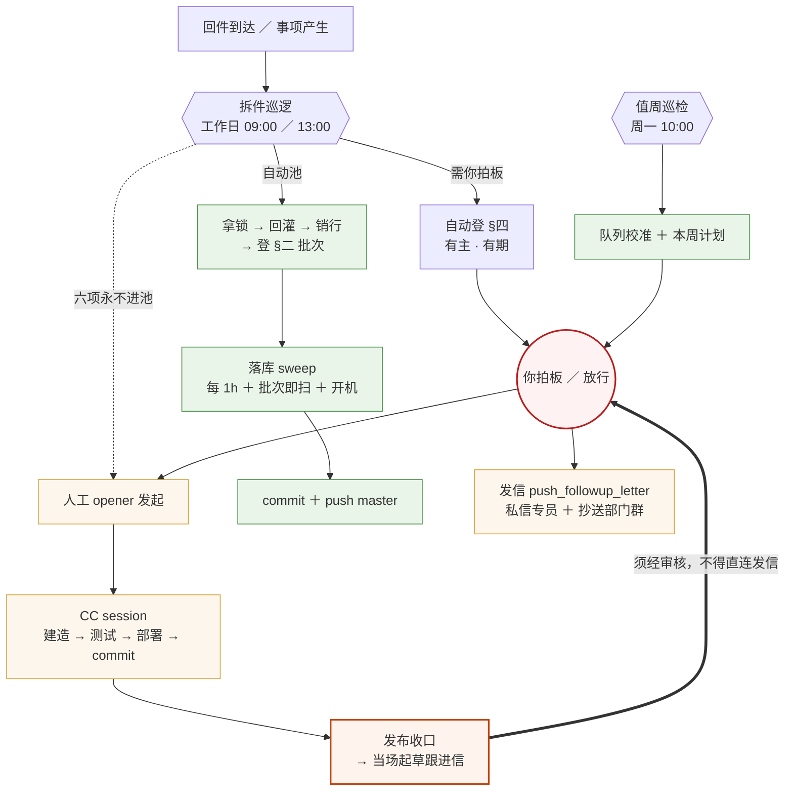

# 机制全景流程图 · 任务流转与发信闭环

> **本文件为什么存在**：此图此前只以 session 内渲染的形式存在过，**从未落库**（2026-08-03 全库 grep `md/html/mermaid/svg/txt/py/json` 零命中）。
> 后果是它**逃过了所有参数一致性扫描**——图上「落库 sweep 每 4h」自 2026-07-31 队列 #189 把周期改为 `PT1H` 起即已过时，
> 而 #203 恰好预言了这种失效形态：「参数一改，引用它的活文档不会自己更新，也没有反向索引」。**落库即是让它此后能被扫到。**

---

## 一、流程图

---

## 二、关键约定（图上看不出、但不能丢的四条）

### 1. 六项永不进自动池（铁律）

权威出处 `Dispatch试点-回件拆件巡逻-设计-2026-07-24.md` §一：

> **对外发送（跟进信／催办）、CC 建造与 commit 发起、口径新裁决（预案未覆盖的）、design 审、L2 门禁、全景重组**

歧义处理承袭 clarify 纪律的无人值守形态：**不猜，登 §四 报，跳过该行。**

### 2. 发信是单一出口、两路喂入 —— 不是两个出口

`push_followup_letter` 的**唯一上游**是「你拍板／放行」。喂入它的有两条路：

| 路径 | 来源 | 依据 |
|---|---|---|
| ① 人工起草 | 专线按事件驱动起草跟进信 | 跟进纪律（CLAUDE.md §5） |
| ② **发布后自动起草** | CC 完成发布收口 → **当场起草** → 当次会话内提交审核 | CLAUDE.md §5 场景固定流程**第 8 步**（2026-07-31 定）＋ `README-跟进机制与命名约定.md` L22 |

**② 不得直连发信**。红线是「未获审核不得发送」；且 #124 阶段二的安全内核正是要把「你审过」从*靠人自觉*改为*靠状态机*——
README 状态列两态语义：专线起草只能标 `⏳ 待你审`，**你改为 `🆕 待发` 即为放行动作**，自动化只对 `🆕 待发` 行动作。
画成两个平行出口，等于在图上承认存在一条不经审核的发送路径。

### 3. 「② 该起草而没起草」目前无检测（已知缺口）

第 8 步只是**成文规则**，没有任何机制能发现「某场景发布收口了、却没起草跟进信」——全靠当次 CC session 自觉。
现有唯一沾边的载体是 #124 阶段一的「待发信盘点」，但它扫的是 README 里**已存在**的 `🆕 待发` 行；
**信压根没被起草出来，它就扫不到**。此缺口已按 2026-08-03 决议挂进队列 #124 行内，作为其阶段二的第三条前置，
于 **2026-08-06**（#124／#122 同批评估时点）一并判。

### 4. 图上的参数以队列为准，不以本图为准

本图涉及的可变参数只有一处：**落库 sweep 周期 = `PT1H`**（2026-07-31 队列 #189 由 4h 改，2026-08-02 #203 复检确认）。
改动该参数时，按协议〇.8「批次行须声明本批变更参数 ＋ 已复检」，**本文件属须复检的活文档之一**。

---

## 三、变更记录

| 日期 | 变更 | 依据 |
|---|---|---|
| 2026-08-03 | 首次落库。补画 `CC session → 发布收口起草跟进信 → 你拍板/放行` 一条边（此前图上缺失）；`每 4h` 更正为 `每 1h` | Shao Peishen 2026-08-03 拍板选项 ①(a)；CLAUDE.md §5 第 8 步；队列 #189／#203 |
