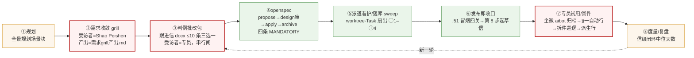

# 端到端构建 workflow 优化 · 方案

`▶ 本报告 5 项定夺：5 项⟨就地答⟩，0 项待总线派发（方案未落档前不登队列）`

> **结论一句**：三轮瘦身把手册第 2–3 阶段（spec／plan／build）和编排层治稳了；你感到的两处瓶颈正是手册说的「构建两侧以人的速度运行的环节」——第 1 阶段（intent）和第 4 阶段（反馈）。**这两端的机制已经设计完、有的连包都落了，但一件都没建成**：`intent` 层（R1 口径点台账）tasks **0/29**、台账目录不存在；成本近零的止血件（`决策点:` 字段恢复）9 月 3 封新信 **0/3** 落字；grill 自 8-18 只跑过 SC2 一例，此后 14 个新场景立行零 grill。**病根不是设计，是排期：需求侧三行（#447／#439／#440）全部 🛑 排在机制类可动 WIP 23/22 之后，而占位的全是环境类行。** 所以本方案第一刀不是新机制，是给需求侧让位。

---

## 一、现状端到端流程（只读取证，2026-09-06）

| 环 | 载体 | 机器守 | 现状判定 | 证据（取数方式） |
|---|---|---|---|---|
| ② grill | `需求grill产出-*.md`（仅 SC2 一份） | 无（skill 是人守） | 🔴 **用过一次即停**；SC4 权威排期 2026-10、`#463` 十四个新场景无一跑过 | `find 4-数字员工 -name "需求grill产出*"` ＝ 1；`#467`–`#474` 行内无 grill 指针 |
| ③ 判例包 | 跟进信 docx ＋ README 八态 | 登记 CLI／闸查询／代词哨兵（二期已建） | 🟡 方法有效，但**单位是信不是点**；`决策点:` 字段 7 月 37%→8 月上旬 70%→8-11 起 **0%**，9 月 3 封仍 0 | `grep -l "^决策点:"` 于 8–9 月信件＝7/34，全在 08-03～08-10 |
| intent 层 | `openspec/changes/coverage-point-ledger/`（09-02 落包，design 审 09-01 已过） | — | 🔴 **tasks 0/29，`口径点台账/` 目录不存在** | `grep -c "\[ \]" tasks.md`＝29；`ls 口径点台账`＝不存在 |
| 新场景包 ×8 | `sc4／sc10／sc11／fi5／fi6／fi8／fi9／fi10` 八个 openspec 包（09-03 无头泳道批量 propose） | 四条 MANDATORY | 🔴 **零 grill／intent 引用；7/8 无 `design.md`（审未过）；已勾任务 130 条（脚手架／mock／判据 `None` 占位），未勾 198 条里按 FI10 形态估每包约 5 条＝≈40 条是「判据签认／持有人实名／口径归属」需求点，散在 8 份 tasks.md 里无人汇总**；代码侧 `criteria_signoff` 注册表已登 **18 条判据、签认 1 条** | 逐包 `ls design.md`／`grep -c "\[x\]"`／`grep -ril grill\|intent`；`grep -o "Criterion(" */config.py` |
| ④⑤⑥ | openspec／sweep／hooks ⓐ–ⓓ ⓗ2／`.51` 四关 | 强 | ✅ 三轮瘦身后稳定，本件不动 | 复盘件 §三 |
| ⑦ 回件 | aibot 归档→§一「企微反馈自动归档」行→拆件巡逻 09:00/13:00 | 桥一 stem 匹配（#366）、形态识别（#446 done） | 🟡 通道通，但 **回件＝自由文本，口径确认与使用反馈混在一条信里**；「该起草而没起草」自 08-03 起无检测；灰度反馈入口＝规则一句，FI2 自陈「暂未新增专属反馈入口」 | digest 里「企微反馈自动归档」§一 20 行；`FI2/CLAUDE.md` L146 |
| ⑧ 度量 | 度量复盘（信级） | 无 | 🔴 中位 2 天→7 天全是账的伪影，12 封真实回件日已被补记覆盖销毁 | `design审前置-…-2026-09-01.md` §4.4 |

**在途 openspec 包 56 个：机制类 38 ／ 业务类 18**（`find openspec/changes -maxdepth 1 -type d`，按包名归类）。08-30 评估件「治理层工作量已超过业务层」这句，一周后更重了。

## 二、「加了 intent 环节但效果不明显」的诊断

你说的 intent 环节＝R1 口径点台账（手册 03 intent.md 的本地对位）。它经历了：08-30 评估立项 → 09-01 `OP-0901-D` design 审前置（九条 Decisions、三开放点全拍）→ 09-02 `OP-0902-A` 落包（还重复劳动了一次，`#439` 行内已如实登记）→ **至今 🛑**。三个事实：

1. **它没建成，所以谈不上效果。** 建成前信仍是自由文本，拆件、转态、度量都还锚在「信」上。
2. **它的零成本上游也没动。** `#447`⑴「下一封信起必写 `决策点:`」不依赖 R1、Cowork 半天、立刻止血——但 9 月三封新信（IT部 09-02、质量部 09-02／09-04）一封都没写。原因同样是 🛑：行在排队，起草 skill 里没这句，人守就消亡（覆盖率 70%→0% 的第二次重演）。
3. **grill 没挂闸，于是 8 个新场景一夜之间全跳过了它。** 它是 skill、不是 openspec 的前置条件，09-03 无头泳道批量 `propose` 八个包不报错——「错误不产生任何信号」一族。泳道做得其实很规矩：判据一律 `None` fail-loud、mock 先行、`criteria_signoff` 注册「该谁签」；**但结果是需求问题被推到了流水线末端**——18 条判据只签了 1 条、7 个 design 审等你、≈40 条「找持有人／定口径」收口任务散在 8 份 tasks.md 里，跟进信侧完全看不见它们。建造越快，这一堆越大。
4. **同一个「点」正在长出两本账。** 需求侧 R1 台账（jsonl，专员判例点）还没建；代码侧 `criteria_signoff`（`Criterion.key／question／owner／Signoff.evidence`）09-03 已建成 28/32。两者说的是同一件事——「这条口径谁定、定了没、凭据在哪」。不打通，就是第二个「README ↔ 队列 576 处交叉引用」。

**根因一句**：协议〇.9 的 WIP 上限对「机制类」一视同仁，需求侧的三行与环境类行争同一池子；环境类行天天派生（本周 §一 新立 #486–#490 全是 `[D:机]`），需求侧永远排不到。上限本身是对的（它拦住了强推），错的是**池子没分域**。

## 三、手册对照（相对 08-30 评估件只写变化）

| 手册 play | 08-30 判定 | 2026-09-06 | 说明 |
|---|---|---|---|
| ① intent.md | ❌ | ❌（已设计未建） | 见 §二 |
| ③ CLAUDE.md 分层＋引用式装载 | ✅ 但「前提是 R4」 | ✅ **已做**（根 48.6→10 KB、rules 5 份、协议〇 判据版） | 是在无 eval 下做的，靠 grep／lint／git 验活兜底——R4 仍欠 |
| ③ Hooks 护栏 | 🟡 PreToolUse 阻断＝0 | ✅ **ⓒ 编辑锁守卫、ⓗ2 读侧守卫两枚阻断类已上线** | 手册「auto mode 前提之一」已部分满足 |
| ④ eval | ❌ 0 | ❌ 0（`#440` 🛑） | 手册 06；CI 凭据边界待 design 审 |
| ④ REVIEW.md／子 agent | ❌ | ❌（`.claude/agents/` 仍空） | 本轮不建议动（见 §六） |
| ⑤ hooks 作审批门禁 | 🟡 | 🟡 L2／design 审仍人守，属「永不自动化的闸」 | 不动 |
| ⑥ 确定性检测＋σ 分级 | ❌ | ❌ | **本件 W5 直接搬**：用于「使用反馈」而非运维 |
| ⑥ 事故→intent 自动闭环 | ❌ | ❌ | **本件 W6**：回件举证→黄金用例 |
| ⑥ Claude Tag | 不适用 | 不适用 | 企微无对等能力 |

手册还有一句这次要用上：**「每个阶段结束往版本控制里写一个产物，下一阶段从读它开始。」** 本项目 ④ 往后全满足；②③ 的产物（grill 产出、判例回件）都是**给人读的 .md／docx**，不是**给机器读的**，所以下一阶段读不动，只能靠人转述——这就是你感到「呈现和确认」慢的机械原因。

## 四、优化方案（七刀，按两端分组；W0 是前提）

### W0 · 给需求侧让位（零建造，一句口径）

> 🔴 **Shao Peishen 2026-09-06 改判（不取 (a)(b)(c) 任一）**：**协议〇.9 不改、上限 22 不提、不分池；今天去掉 `#439` 的 🛑；「余量优先给需求侧」写死**——落点＝`rules/队列与落库.md`（值周巡检／总线去 🛑 顺序＝需求侧行先），判据一句＝该行建成后减少的是「以人的速度运行的环节」。实测 WIP 20/22（`_count_mechanism_wip` 当场重跑），去 🛑 后 21/22、本件新立一行后 22/22，**无需任何豁免**。下方为拍板前原文，保留供追溯。

～～原文：协议〇.9 WIP 上限保持 22，但**分域**：`[D:机]` 行内再分「环境／需求」两池，需求池保留 **2 位**且不被环境类挤占；或者等价做法——两周内机制类新行「只登不领」冻结，直到 `#447`→`#439`→`#440` 三行开工。**代价**：环境类排队行再等两周（本周瘦身已收口，正好是窗口）。这是 §二 根因的直接解，不做它，后面六刀全是纸。～～

### 瓶颈 A · 业务场景需求呈现与确认

**W1 · 场景级 `intent.md` 定版并挂 openspec 闸**（承 #436 ⑶①）
- 每个新场景目录固定一份 `intent.md`（＝现在的 `需求grill产出-*.md` 改名定版，frontmatter `status: 已确认` 由你确认后写），三节固定：§一 M2 自查事实／§二 已定（＝design Decisions）／§三 待专员（＝判例包待办，每条带口径点 ID 占位）。
- **闸**：`/opsx:propose` 针对 `4-数字员工/**` 的场景包，前置检查同目录 `intent.md` 存在且 `status: 已确认`；缺则拒并给 grill 入口。落点＝`openspec` 自定义 validate 规则或 PreToolUse hook（Bash 匹配 `opsx:propose`），二选一由 CC 实测定。
- **存量 8 包补 grill**：每包一次会话（SC2 实测 5 轮 14 问、约 1 小时），先 FI10（tasks 最接近收口、收口项全是需求点）；grill 产出直接改写各包 `design.md` Decisions／Open Questions，**顺手把 7 个欠着的 design 审材料备齐**——补 grill 就是补 design 审前置，不是额外一道工。SC4 已正式顺延（09-03），排最后。`#463` 剩余未落包场景一律先 `intent.md` 后 `propose`。
- **不动**：grill 受访者只有你（融合方案 §三 边界一字不改）；深化类场景不跑。

**W2 · R1 口径点台账落地（已设计，只欠 apply）**
- `#439` 去 🛑 → CC `openspec apply coverage-point-ledger`（design 审已过、D1–D9 全定、`.gitignore` 例外已在临时仓验过 11 条，CC 须在真仓复跑）。
- 先做 tasks 组 1（建表）＋ 2.1（吃 18 封带 `决策点:` 的信作黄金集）；组 4（闸取数切换、28 天并跑）与组 5（README 编号列降派生）顺延，不抢本轮。
- 判例包生成改为**从台账取「待问」点投影**（`zhuopin-followup-letter` 加一步：先 `台账查询 --to <收信人> --status 待问`），回件解析（#446 已建形态识别）回写台账状态。**信是视图、点是真身**从这一步才真的开始。
- 🔴 **与代码侧 `criteria_signoff` 打通，不建第二本账**：台账 `id` ＝ `Criterion.key`（场景码前缀同构）；各场景 `CriteriaRegistry.unsigned_keys()` 即台账「待问」点的自动来源（今天就是 17 条）；专员签认回件 ⇒ 台账转 `已签认` ⇒ 同一动作写 `Signoff(signed_by, evidence=回件落档件)`。`criteria-signoff-platform` design 审（未过）与 R1 台账 design 合并一次审，加一条 Decision「两者 ID 同源、状态单向由台账驱动注册表」。

**W3 · `决策点:` 字段今天恢复**（`#447`⑴，Cowork 半天）
- `zhuopin-followup-letter` 起草期自检加一条：frontmatter 必写 `决策点: N 项（a / b / c）`，按 P1 判别式拆（一条能单独批复＝一点）；`工具-跟进信README登记.py append` 校验该字段非空，缺则拒登记。
- 这是 W2 的数据源，也是唯一不需要等任何 WIP 的一刀——**建议今天做**。

**W4 · 呈现形式：判例批改法不动，加一种「可点的判例」（灰度一处）**
- 现在专员在 docx 里勾 ✅/❌/✏️，回件走企微、拆件靠巡逻。对**已上线场景**的口径点，可以把同一份判例三选一直接呈现在场景 web 页（「待你判定」页签：判例原文／现状判定／拟改判定／三个按钮＋一句话框），点击写 `audit`（append-only）→ outbox → aibot 中继（`#394` 在建）→ 台账回写。
- 只灰度 **SC8＋姚祖怡**（回件最勤、场景已稳），docx 信继续并行作正本；判据类点仍**永不默认生效**，页面上只是把「填 docx」换成「点按钮」，签认语义不变。
- **前置**：`#394` outbox→aibot 中继；`#240` 企微凭据未批前用每专员专属链接 token 识别身份（无鉴权则不上线）。**本轮只立行、不建造**——它是 W2 之后的事。

### 瓶颈 B · 构建成果使用反馈

**W5 · 使用反馈的确定性检测层**（手册 08 搬用；承 #436 ⑶③）
- 现在「用没用、好不好用」全靠专员在信里说；而平台 `audit` 已经记录每一次 AI 决策，场景 web 也有访问面。**先查事实再问人**（M2 的反面用法）：每周一 job 只读各场景 `audit`／访问日志，出「使用度量」：谁用了、几次、哪些功能 7 天零触发。
- 🔴 **Shao Peishen 2026-09-06 改判（第三条路）**：**立项，但砍掉「自动往 README 写 `⏳ 待你审`」那段；先跑一次只读采样；三档按仓库真身 3／7／14**（08-30 评估件 §四 R3 原文档位）。⇒ 分级动作全部确定性、不涉模型、**不写 README**：**3 天零使用→只记日志；7 天→只读诊断（查 `audit`／访问日志／企微记录，命中则记「已在用但未留痕」）；14 天→报「需你定夺」（是否起草使用确认判例包／深化／下架）**——起草与否由你答，不自动起草。**首个交付＝一次只读采样报告**（FI2／SC8 两场景近 30 天：谁用了、几次、哪些功能零触发、日志可读性与缺口），采样报告过目后再决定 job 化与阈值。
- 灰度：FI2（唐燕萍＋李姣龙）与 SC8（姚祖怡）两个已在真实使用的场景。`#358`（`.51` 审计日志 309 MB 无轮转）顺带一起收——度量 job 读的就是这份日志。
- ～～原文（拍板前）：7 天零使用→只记日志；14 天→自动起草「使用确认」判例包草稿进 README `⏳ 待你审`；30 天→进「需你定夺」。～～

**W6 · 反馈→黄金用例闭环**（手册 05／08「事故→intent 自动闭环」）
- 发送前置③ 已要求「用专员原始举证端到端复现」，但复现结果**不落成回归**。改为：拆件巡逻派生行必带举证文件路径（`7-外部文档/…`）；CC 领行时**先把举证写成失败用例**（`tests/golden/<部门#N>-<点ID>.py` 或 fixture），再修；CI 黄金基准守它不漂移。
- 效果：同一条口径不会第二次被专员抓到（FI2「发票缺失」假报错、SC8「答交日期只取最早」这类 `#418`／`#344` 就是没落成用例才复发的形态）。
- 台账点状态在 W2 的六态后加一态 **`已验收`**：由专员回执或 W5 度量「≥N 次使用且无异议」转入——**只对展示类点允许度量转态，判据类仍只认回件**。

**W7 · 「该起草而没起草」检测** —— 🔴 **更正（2026-09-06 17:40）：机制已存在，本刀撤回。** `5-平台底座/wecom-aibot-service/scripts/draft_gap_check.py`（`#245`）已并入 `工具-落库sweep.py` 第 11 类常驻告警（`#382`⑵），每轮回显「跟进信起草缺口检测」。本件 §一 表「⑦ 回件」行写的「自 08-03 起无检测」是过时判断——**取证时只读了 08-03 流程图与 08-30 评估件，没查 sweep 现状**，与 08-30 R3 同族（提方案前未查已有能力），已计 `#284`。下方原文保留。～～（自 08-03 已知缺口，零方案至今）
- 确定性扫描并入 sweep 告警类：场景 `CLAUDE.md`「部署状态」段日期晚于该场景最近一封跟进信日期且超 3 天 ⇒ 告警到企微＋§四 登记。不自动起草，只报。

### 明确不做的（保留优点）

判例批改法格式／≤10 条／不加并行专员一字不动；串行闸原则保留（改按点计＝R2，等 W2 并跑 28 天后另议）；design 审、L2 门禁、对外发送、ASIL 禁区永不自动化；手册的阶段间 auto mode 本轮不开（eval 仍＝0，`#440` 落地后再议）；子 agent／REVIEW.md 不建（先有 eval 才能判断 agent 是否变差）；根 `CLAUDE.md` 不加一行，本件所有口径落 `rules/场景建造与合规.md`、`rules/跟进信与专员.md` 与对应 skill。

## 五、次序与并行矩阵

| # | 环境 | 内容 | 能否立即开工 | 并行 | 触碰区 | 估时 |
|---|---|---|---|---|---|---|
| W0 | Cowork | 协议〇.9 分池一句＋`#447/#439/#440` 去 🛑 | 你一个字母后立即 | — | 队列顶部协议〇、三行状态列 | 1 h |
| W3 | Cowork | `决策点:` 恢复：skill 自检句＋登记 CLI 校验 | 零依赖，今天 | 与 W0 并行 | `zhuopin-followup-letter/SKILL.md`、`工具-跟进信README登记.py`（校验＝CC 小改） | 半天 |
| W2 | CC | `coverage-point-ledger` apply 组 1＋2.1 | W0 后 | 与 W1 并行（不同触碰区） | `6-人才与组织/部门AI专员跟进/口径点台账/`、`.gitignore`、台账读写模块 | 1–2 天 |
| W1 | Cowork 口径→CC 闸；grill＝Cowork 会话 | `intent.md` 定版＋propose 闸＋存量 8 包补 grill（先 FI10） | 口径零依赖；每包 grill 需你一次会话（约 1 h） | 与 W2 并行 | `rules/场景建造与合规.md`、`zhuopin-requirement-grill`、openspec validate／hook、各场景 `intent.md`＋包内 `design.md` | 口径半天＋闸 1 天＋grill 8 会话（可拆 2 周） |
| W7 | CC | 「该起草而没起草」扫描并入 sweep 告警 | 零依赖 | 与任何并行 | `工具-落库sweep.py` 告警段 | 半天 |
| W5 | CC（走 openspec） | 使用度量 job＋三档确定性动作，FI2／SC8 灰度 | 软序于 W3（起草草稿要写 `决策点:`） | 与 W2 并行 | 新建 `工具-使用度量.py`、`.51` 审计日志、README（只写 `⏳ 待你审`） | 2 天＋1 个月观察 |
| W6 | CC（口径 Cowork） | 派生行带举证路径＋黄金用例先行＋台账 `已验收` 态 | 软序于 W2（台账态） | — | 拆件巡逻派生模板、`tests/golden/`、台账 schema | 1 天 |
| W4 | 只立行 | 「可点的判例」SC8 灰度 | 硬阻塞于 `#394` 中继＋W2 | — | 登 §一 待领，不派 | — |

**效果估计**（能测的才写）：需求收敛从「场景块→propose 之间无产物」变为每场景 1 份 `intent.md`＋1 次 grill 会话（SC2 实测 5 轮 14 问，0 问流向专员）；口径点度量从「信级、已被补记污染」变为台账直算，且事实日不可覆盖；使用反馈从「等专员开口」变为 ≤7 天必有信号、14 天必有一封确认草稿；同一口径二次被抓＝0（黄金用例）。治理层比重：W0 两周内不新领机制行，在途包机制 38／业务 18 的比例开始回落——这一条本身就是可证伪判据，两周后重数。

## 六、需你定夺 —— 🔴 **已于 2026-09-06 全部拍板，本节转为决议记录**

| # | 事项 | 你的裁决（2026-09-06） | 落点 |
|---|---|---|---|
| ① | W0 让位方式 | **不取任一选项：不改协议〇.9、上限 22 不提；今天去 `#439` 🛑；「余量优先给需求侧」写死** | `rules/队列与落库.md` 一句；`#439` 任务列与状态列去 🛑（WIP 20→21/22） |
| ② | `决策点:` 今天恢复 | **(a) 改 skill 自检句＋出登记 CLI 校验派单（需重装一次 skill）** | `zhuopin-followup-letter/SKILL.md` v3.8 §5 步骤 1bis＋禁止项；CLI 校验＝队列需求侧机器守行 ⑴ |
| ③ | `intent.md` 命名与闸 | **(a) 统一文件名 `intent.md`，闸落 openspec validate** | `rules/场景建造与合规.md` §二 一句；`zhuopin-需求grill/SKILL.md` §四 产出定名；闸＝需求侧机器守行 ⑵ |
| ④ | W5 使用度量 | **第三条路：立项，砍掉自动写 README `⏳ 待你审`；先跑一次只读采样；三档按仓库真身 3／7／14** | §四 W5 已按此改写；需求侧机器守行 ⑶＝只读采样报告 |
| ⑤ | 8 包 design 审积压 | **(a) 逐包补 grill、会话末当场审** | grill skill §四 存量补 grill 一句；首个＝FI10（opener 另出） |

━━━ 以下为拍板前原文，保留供追溯 ━━━

`▶ 5 项⟨就地答⟩`（答完由本会话或你指定的下一棒动手；本件未落档、未登队列——你答 ① 后我再登）

**① W0 让位方式（决定其余六刀能否开工）**
- **(a) 协议〇.9 分池：`[D:机]` 内设「需求池 2 位」，`#447`／`#439` 即刻去 🛑，`#440` 排第三**（建议）——改协议〇一句＋三行状态列，Cowork 本会话走锁可做；代价：环境类排队行（`#381`／`#382`／`#464`／`#489`）再等。
- **(b) 机制类新行两周「只登不领」冻结**，需求侧三行按现有池子自然到位——不改协议〇，但靠人守两周，按退休制判据不稳。
- **(c) 不动**——需求侧继续排，本件其余六刀顺延。
- **默认项：不答按 (a)。**（执行者＝本会话；不答的代价＝错误继续发生，故给默认。）

**② W3 `决策点:` 恢复今天做不做**
- **(a) 今天做：本会话改 skill 自检句，登记 CLI 校验出 CC 派单**（建议）——代价：`zhuopin-followup-letter` 需你在 Settings 重装一次。
- **(b) 并入 W2 一起做**——多等一至两天，期间新信继续不带字段。
- **默认项：不答按 (a)。**

**③ W1 `intent.md` 命名与闸形态**
- **(a) 文件名统一 `intent.md`（SC2 的 `需求grill产出-2026-08-18.md` 改名定版），闸落 openspec 自定义 validate**（建议）——与手册同名便于对照；validate 两桌都跑得到。
- **(b) 保留「需求grill产出-日期.md」命名，闸落 PreToolUse hook**——不改名，但 hook 只 CC 有效、Cowork 起草 propose 时拦不住。
- **默认项：不答按 (a)。**

**④ W5 使用度量本轮立项与否**
- **(a) 立项，FI2＋SC8 灰度，走 openspec（改既有模块对外语义＝命中门槛③）**（建议）——代价：一个 CC 包＋一个月观察；`#358` 审计日志轮转一并收。
- **(b) 等 W2 台账落地后再立**——反馈端再晚一个月才有信号。
- **默认项：本项无默认，须你明确答复**——它新增一条会往 README 写 `⏳ 待你审` 行的自动路径，涉你审核面，不该由我默认开。

**⑤ 存量 8 包的 design 审积压怎么消（7 个场景包＋`criteria-signoff-platform`）**
- **(a) 按 W1 逐包补 grill，grill 产出即 design 审材料，你在 grill 会话末当场审**（建议）——一次会话解决「问需求」和「审设计」两件事；代价：8 次会话，每次约 1 h，可两周内拆开。
- **(b) 本会话先出一份 8 包合并审材料（同类 Decisions 归并、只列分歧点），你一次审完，grill 事后补**——最快清积压，但等于在需求没问清前拍设计，与 W1 的方向相反。
- **默认项：不答按 (a)。**（执行者＝你＋Cowork 起草线；不答的代价＝8 包继续停在 🟡。）

### 状态同步（无需你答）
- 拍板前本件全程只读；拍板后（2026-09-06 17:10 +08:00 起）由同一 Cowork 会话落字：本件落档 `1-转型规划/0-全景路线图/`、两句 rules、两份 skill 源码、队列四处回写＋一新行＋§二 批次——执行记录见队列 §一 `#436` 状态列末段。
- 实测数字取数方式已逐条写在 §一 表「证据」列；日期基准＝本机 2026-09-06（`Get-Date`）。
- 本件承接 `#436` ⑶，并入审核已做：`#452`（泳道看护）、`#454`（状态分诊）、`#462`（规划倒逼开工）均为不同环节，不可并；W7 承 `#124` 阶段二第三条前置（08-03 挂起至今）。
- 转场判据五条逐条过：无忘记本会话事实／无重复劳动／无未标更正的矛盾／无丢失指令（「暂不动文件、不锁文件」全程遵守）／token 压力不真实 ⇒ **不必转场**。
