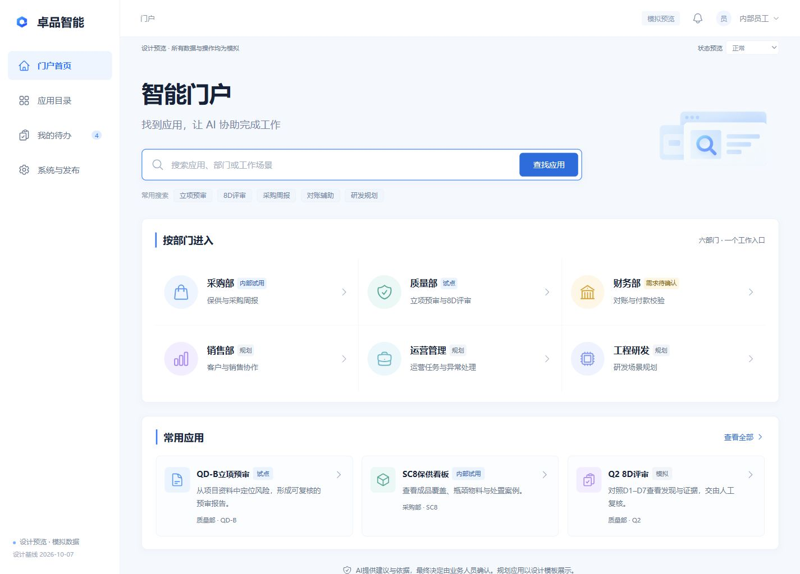
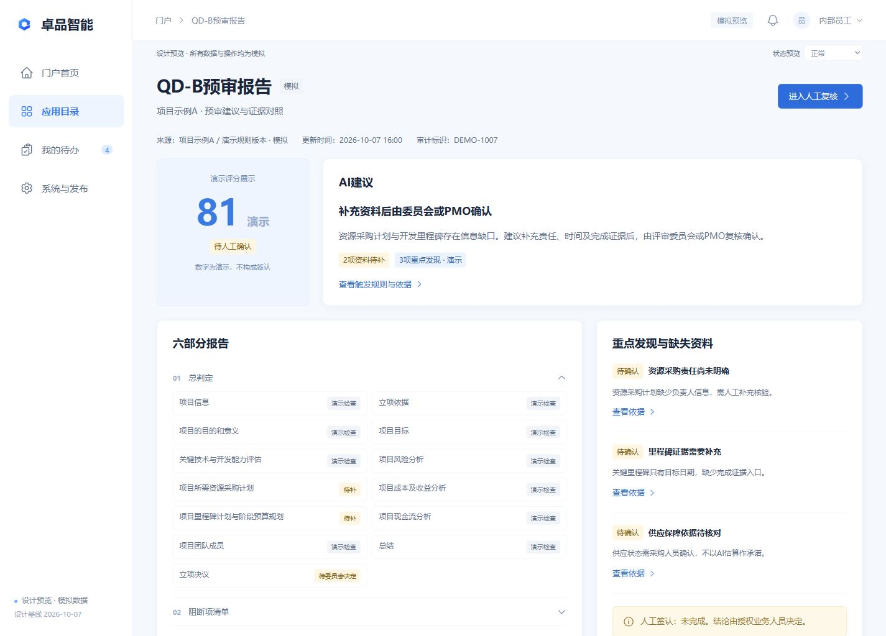
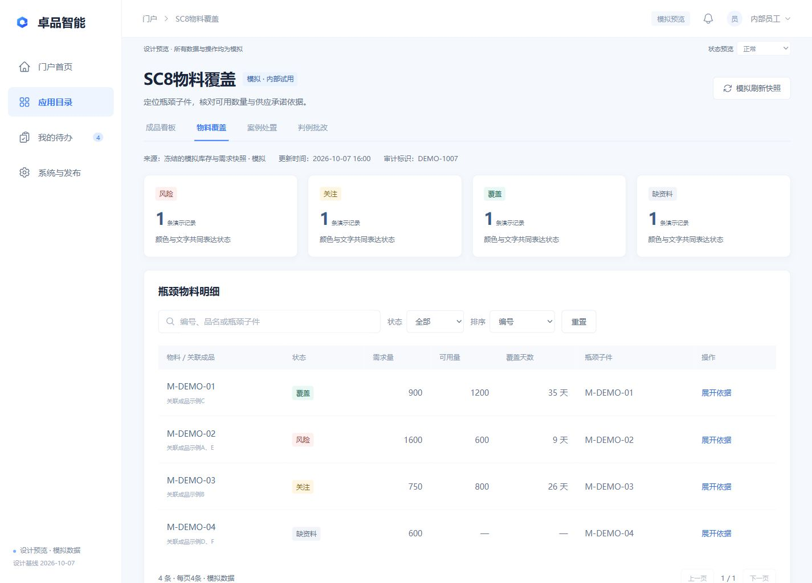
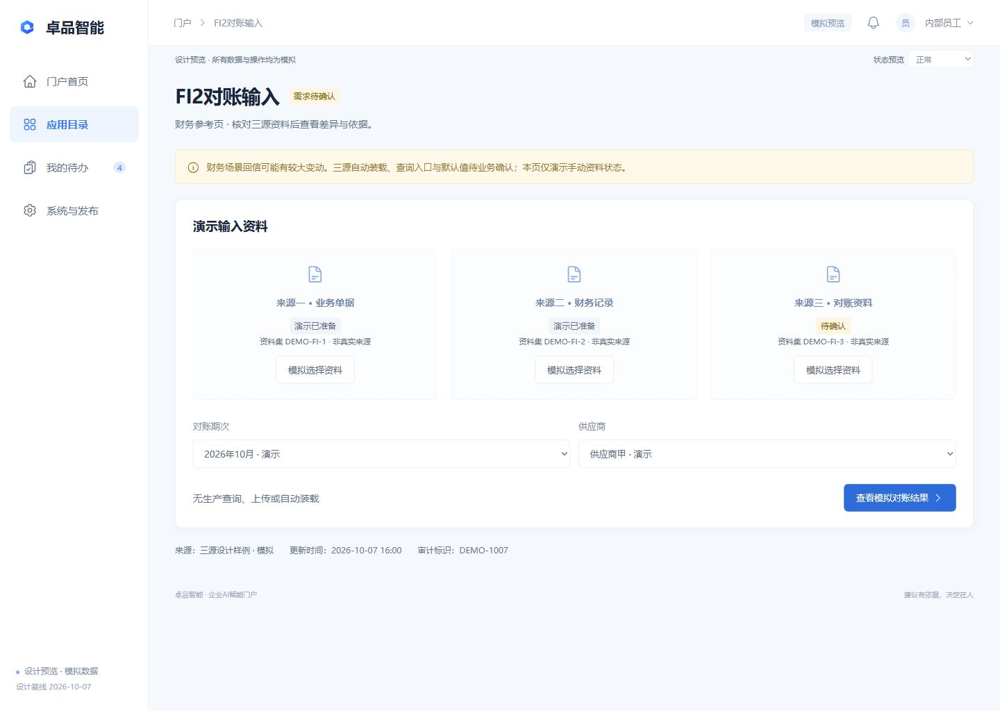
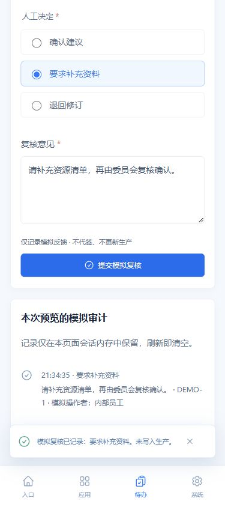

# 智能门户高保真UI方案审核稿

供 Shao Peishen 审核整套业务体验。已选择方向1 明亮企业办公，修改意见无。本稿覆盖25类桌面页面、4类移动关键页面、统一UI规范与分模块应用建议。

本轮完成设计与模拟原型，不改变生产API、认证、业务规则或部署。整套体验审核后另拟正式实施计划，合入和生产发布逐项授权。

P02 门户首页  1440×1024  六部门加应用入口  全部数字与业务操作均为模拟。

审阅入口 http://127.0.0.1:4173/  完整25页效果图见同目录效果图总览.html。预览依赖本机服务存续，原型源码包可复现。

## 质量完整样板

QD-B采用库内现有报告的六段结构和13模块。演示评分81不映射正式等级，委员会或PMO保留最终决定权。Q2采用D1到D7，既有分级、红线和质量工程师签发责任不因界面调整改变。

P14 QD-B预审报告  先看建议，再看规则与证据，补齐缺失资料后进入人工复核。

上传页继承XLSX及20 MB上限，模板为EQQR8082 A2.1。原型只校验文件名称、类型和大小，不读取正文或上传。C05与档三未签认的效力缺口保留。

## 采购统一适配

SC8覆盖成品、物料、案例和判例批改。四色同时提供文字说明，支持中文筛选、排序、分页、依据展开。物料使用独立样例数量，避免混用成品统计。

P19 SC8物料覆盖  来源及更新时间就近展示，缺资料不等同无风险。

SC2周报保留期次、来源和人工备注。现网SC2打开超时、SC8结果表未核验的缺口继续登记。缓存刷新与业务重算分开，本稿不新增齐套规则、R2阈值或真实六键取数。

## 财务参考与调整边界

财务需求回信尚未正式入档。FI2输入、结果和FI3付款清单作为信息结构参考，均显示需求待确认，未冻结默认查询、差异阈值、结案流程或付款权限。

P23 FI2对账输入  本原型展示三源参考结构，数据导入及查询均为模拟。

FI3逐项勾选及记录只产生演示反馈。收款方、账户尾号和金额为模拟，付款状态保持未执行。财务回件归档后再确认字段与适配顺序。

## 移动端关键流程

移动端重点覆盖部门与应用入口、待办、结果查看和人工复核。底部导航显示当前项，侧栏关闭后不进入键盘焦点，支持关闭按钮和Escape返回触发控件。

390×844首屏样例。长页面正常滚动，宽表格限于表格容器横向查看，页面本身没有横向溢出。企微实际WebView与角色映射留待项目实施验收。

## 移动结果与人工复核

结果按建议、依据、缺失资料分层。人工决定必选，意见至少6字的表单校验为设计建议。反馈明确仅模拟记录，没有正式签认或生产写入。

复核记录仅在本次预览的页面会话内存中保留，刷新即清空。生产实施须绑定正式身份、权限与审计接口，L2不代签。

## 统一UI规范

| 变量 | 规范 |
| --- | --- |
| 颜色 | 品牌蓝#1677ff；主按钮#126bd9；主文字#18253b；辅助文字#63738b；背景#f5f8fc；白色业务卡片。 |
| 字体 | Microsoft YaHei等本地字体。业务标题28px、正文14px、元信息12px；移动正文14px、元信息11px。 |
| 布局 | 桌面1440×1024，侧栏214px，顶栏66px；移动390×844，内容边距17px，底部四项导航。 |
| 组件 | 导航、检索、筛选、表格、上传、报告、证据、人工复核、来源时间与反馈采用共同表达。 |
| 资产 | Heroicons标准图标及独立生成插画。蓝色品牌图形为概念占位，应用前替换已核的官方资产。 |
| 键盘 | 原生Tab、Enter与空格，跳到主要内容、可见焦点及减少运动；移动底部当前项提供aria-current。 |

颜色不独立承载状态。服务在线、AI建议或绿色状态都不能等同业务通过。所有来源和更新时间就近可见，mock、试点、规划与需求待确认保持明确。

| 状态 | 表达及动作 |
| --- | --- |
| 加载 | 保留上下文，正在加载演示快照。 |
| 空数据 | 暂无符合条件记录，可调整筛选。 |
| 失败 | 演示加载失败，可模拟重试。 |
| 陈旧与缺资料 | 显示旧时间或缺口，先补资料再人工确认。 |
| 权限不足 | 提示核验角色，不默认扩大权限。 |
| 规划与试点 | 入口显式标阶段，规划没有真实执行按钮。 |

## 公共门户与部门页面目录

| ID | 页面 | 确认程度与主要边界 |
| --- | --- | --- |
| P01 | 员工登录 | 设计建议 / 规划；模拟员工身份进入门户；不创建凭据 |
| P02 | 门户首页 | 继承已确认边界 / 展示建议；部门入口、常用应用及应用搜索 |
| P03 | 应用目录 | 继承已确认边界 / 展示建议；中文检索、部门筛选、空结果与重置 |
| P04 | 我的待办 | 设计建议 / 规划；检索/部门筛选；责任和期限可见，整合是设计目标 |
| P05 | 人工复核 | 继承已确认边界 / 展示建议；建议/依据/缺失资料→人工决定与意见→本地模拟审计 |
| P06 | 系统与发布 | 设计建议 / 规划；服务运行、技术验证、业务验收分开 |
| P07 | 采购部 | 继承已确认边界 / 展示建议；SC8与SC2入口及能力边界 |
| P08 | 质量部 | 继承已确认边界 / 展示建议；QD-B与Q2入口，预审与8D评审分开 |
| P09 | 财务部 | 待业务确认；FI2/FI3参考入口，需求待确认 |
| P10 | 销售部 | 设计建议 / 规划；明确规划模板，无可执行操作 |
| P11 | 运营管理 | 设计建议 / 规划；明确规划模板，無真实任务执行 |
| P12 | 工程研发 | 设计建议 / 规划；规划模板，OEM隔离与ASIL人工审核边界 |

确认程度区分业务边界与新的设计表达。统一待办、登录展示及系统状态聚合属于设计目标，当前尚无全部整合接口。销售、运营、研发采用明确的规划模板。

## 质量采购与财务页面目录

| ID | 页面 | 确认程度与主要边界 |
| --- | --- | --- |
| P13 | QD-B立项预审 · 上传 | 继承已确认边界 / 展示建议；XLSX/20 MB/EQQR8082 A2.1；仅文件元信息校验，模拟进度不读正文 |
| P14 | QD-B预审报告 | 继承已确认边界 / 展示建议；正式六段报告标题与13模块；演示评分不定档、不签认 |
| P15 | 规则与证据 | 继承已确认边界 / 展示建议；规则版本、演示证据坐标、缺失资料与审计 |
| P16 | Q2 8D评审汇总 | 继承已确认边界 / 展示建议；D1–D7、演示分级及报告复核入口，不新增阈值 |
| P17 | 8D报告复核 | 继承已确认边界 / 展示建议；原报告示例对照D6证据，退回仍由质量工程师签发 |
| P18 | SC8成品保供看板 | 继承已确认边界 / 展示建议；四色+文字；中文筛选、排序、分页、展开依据 |
| P19 | SC8物料覆盖 | 继承已确认边界 / 展示建议；独立物料演示数据，关联成品与缺资料态 |
| P20 | SC8案例处置 | 继承已确认边界 / 展示建议；案例状态、来源、责任和批改入口 |
| P21 | SC8判例批改 | 继承已确认边界 / 展示建议；判例反馈及意见校验；不改算法和阈值 |
| P22 | SC2采购周报 | 继承已确认边界 / 展示建议；周次、来源与更新时间；人工备注只模拟 |
| P23 | FI2对账输入 | 待业务确认；三源参考结构；期次/供应商操作仅演示 |
| P24 | FI2对账结果 | 待业务确认；一致、差异待确认、资料不足；模拟意见不结案 |
| P25 | FI3付款校验清单 | 待业务确认；逐项核验；模拟勾选不改变账户、不付款 |

完整路由及来源映射见需求页面映射.json和页面索引.csv。规则效力仍以场景正本及后续签认记录为准，本稿不将早期PRD或界面样例追认为当前规则。

## 验证结论与应用顺序

原型完成25桌面与4移动页面留图，核验导航、中文检索、筛选排序分页、证据展开、缺资料校验、模拟上传进度、人工意见及反馈、清单校验、移动导航与键盘焦点。320及1024窄屏检查无整页横向溢出。

四项Node定向逻辑测试及Vite构建通过。一次Luna只读复核提出的两项移动导航问题已修复并回验。没有运行项目矩阵或业务fixture，也不证明新引擎、机器人监听、队列迁移或生产全链通过。

应用顺序建议为公共框架、QD-B、Q2、采购，财务回件确认后适配。继续保留一个门户入口和独立业务服务，不为统一界面而合并后台。每模块另立intent、design与tasks，定向验证及review后申请发布。

### 整套体验审核记录

1 选择题  A通过进入正式实施计划  B修改后再审  C暂缓。答复不构成部署批准。

2 判断题  六部门加应用入口的首页结构符合工作习惯。是 / 否。

3 判断题  建议、依据、缺失资料和人工决定分层清楚。是 / 否。

4 选择题  A按上述顺序实施  B调整顺序并说明。

5 请按页面ID填写需要修改的字段、信息或操作。

6 请提供已核官方品牌图形的仓内路径，或在实施前另行确认资产。

视觉方向1已经选定，无需重复回答。本稿的整套业务体验尚待审核，正式实施及生产发布保留后续逐项授权。
