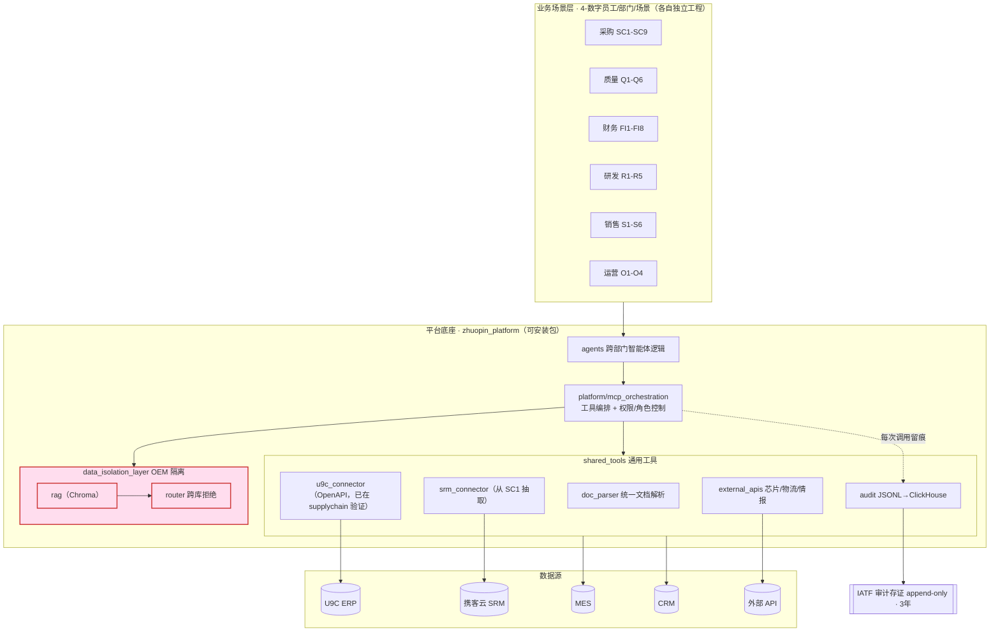

# 平台底座架构设计 — AIOps 讨论稿

> 本文面向 **AIOps 工程实现**，是一份可在团队会上逐条过的技术稿。VP 视角的范围/排序/冲突消除见 `Phase1-基础设施与智能体架构设计.md`，本文不重复，只谈"怎么建、怎么用、还有哪些要拍板"。

## 1. 目的与读者

为六部门 40 个数字员工提供**一套共享底座**，让每个场景只写业务逻辑，审计、OEM 隔离、ERP/SRM 接入、文档解析等"地基"复用同一份代码（单一可信源，满足 IATF）。读者：AIOps 开发与运维工程师。

设计三原则：
- **只读优先**：所有外部数据接入默认只读、最小权限。
- **写入路径与存储解耦**：审计/隔离的业务接口稳定，底层后端（JSONL→ClickHouse、Chroma）可换。
- **可追溯/可解释**：评分用确定性公式或规则引擎，LLM 只做文本生成与检索，决策留痕。

## 2. 架构总览



## 3. 分层组件职责与接口契约

| 组件 | 职责 | 当前状态 | 接口契约（稳定面） |
|------|------|---------|------------------|
| `audit` | 每次 AI 决策写一条可追溯记录，红色数据不落盘 | ✅ 可用（JsonlSink） | `AuditLogger.record(AuditEvent)` / `.query_by(**f)` / `.verify_integrity()` |
| `data_isolation_layer.router` | 按 OEM 上下文路由向量库，跨库/未注册拒绝 | ✅ 路由可用 | `OEMRouter.resolve(oem)` / `.guard(oem, collection)` → 抛 `CrossOEMAccessError` |
| `data_isolation_layer.rag` | per-OEM + 通用知识库检索 | 🔧 待接 Chroma | `retrieve(query, collection, k)`（待定义） |
| `shared_tools.u9c_connector` | U9C 只读数据（采购/财务） | 🔧 待接口 | 复用 supplychain 的 OpenAPI 调用封装 |
| `shared_tools.srm_connector` | 携客云 SRM 交付数据 | 🔧 从 SC1 抽取 | `get_delivery_metrics(supplier_code, days)` 等 |
| `shared_tools.doc_parser` | PDF/Word 统一解析（SC4/Q4/R1/R5 共用） | 🔧 骨架 | `parse(path) -> StructuredDoc`（待定义） |
| `shared_tools.external_apis` | 芯片 EOL/供货、物流、情报 | 🔧 待选型 | 各 provider 适配器 |
| `platform.mcp_orchestration` | 工具调用编排 + 角色/部门/OEM 权限 | 🔧 待建 | 统一入口，调用前鉴权、调用后审计 |
| `agents` | 跨部门智能体逻辑（含 2027Q1 联动编排） | 🔧 骨架 | 由全局 `~/.claude/agents` 沉淀 |

> 「稳定面」一旦定稿，业务场景只依赖这些签名；底层实现/后端可独立演进。

### 审计事件最小字段（已实现）
`scenario, action, evaluator, automation_level, decision{}, data_sources{}, content_hash, oem_context, report_path, error, timestamp`。原始敏感数值（注册资本、IQC 原始值、财务红色数据）**不进**该结构。

### OEM 隔离规则（已实现）
通用库（`kb_supplier/kb_quality_cases/kb_finance_rules`）放行；本客户专属库放行；其它 OEM 专属库或未注册客户 → `CrossOEMAccessError` 并审计。`REGISTERED_OEMS` 维护在 `router.py`。

## 4. 典型数据流（以 SC2 采购周报为例）

```mermaid
sequenceDiagram
  participant S as SC2 场景
  participant O as mcp_orchestration
  participant U as u9c_connector(只读)
  participant A as audit
  S->>O: 请求本周 PO/到货/质检数据
  O->>O: 鉴权（角色=采购, 只读）
  O->>U: 调用 U9C OpenAPI（只读）
  U-->>O: 结构化结果（不含红色数据）
  O-->>S: 数据
  S->>S: 生成周报（DeepSeek 文本 + 确定性指标）
  S->>A: record(AuditEvent: SC2, 数据来源, 内容哈希)
```



## 5. zhuopin_platform 包结构与使用

已建（`5-平台底座/zhuopin_platform/`，Python ≥ 3.11，冒烟测试通过）：
```
zhuopin_platform/
├── audit/{events,sinks,logger}.py
├── data_isolation_layer/router.py  (+ rag/ 待建)
├── shared_tools/{doc_parser,u9c_connector,srm_connector,external_apis}/  (骨架)
├── agents/
└── platform/mcp_orchestration/  (待建)
tests/test_smoke.py
```
**各场景依赖方式**（解决 SC1↔supplychain 跨工程引用老问题）：
```bash
pip install -e ../../5-平台底座/zhuopin_platform
# from zhuopin_platform.audit import AuditLogger, AuditEvent
# from zhuopin_platform.shared_tools.srm_connector import ...
```

## 6. 新数字员工开发流程（沿用，团队统一）

```
1. 新建 4-数字员工/部门/场景名/ ，写 CLAUDE.md 业务上下文
2. pip install -e 平台底座包
3. openspec init → /opsx:propose "场景描述" → 生成 proposal+design+tasks
4. Paul 审查 design.md（15-30 分钟）
5. /opsx:apply → SuperPowers subagent-driven-development（先写测试）
6. 真实数据验证（任务 N.1）
7. /opsx:archive → git commit + push
```
多场景并行期用 SuperPowers `dispatching-parallel-agents`，但**上线节奏受人工审查带宽约束**，不盲目并行上线。

## 7. 环境与部署要点

- Python 3.11+；依赖经 `pyproject.toml`（含 `[clickhouse]`、`[dev]` extra）。
- 凭证走 `.env`（DeepSeek Key、XKY_* SRM、U9C OpenAPI Key），不入库（`.gitignore` 已排除）。
- MCP Server：U9C-MCP v0.1 只读，封装在 `shared_tools/u9c_connector`；SRM 已生产。
- 审计文件 `reports/audit_log.jsonl` 不入库；9 月迁 ClickHouse 时双写灰度校验后切换。
- Git：`Raytheoner/zhuopin-ai-transformation`，master，所有 Skill/Agent 纳入版本管理。

## 8. 待团队讨论拍板的开放问题

1. **mcp_orchestration 鉴权模型**：角色×部门×OEM 三维权限怎么表达？最小可用版长什么样？
2. **doc_parser 选型**：直接用 Claude 原生文档能力，还是先抽文本（pdfplumber/docx）再喂模型？统一 `StructuredDoc` 字段定义。
3. **U9C-MCP v0.1 接口面**：复用 supplychain OpenAPI 封装到什么粒度？只读视图清单由谁与 IT 对齐。
4. **审计迁移 ClickHouse 的触发条件**：记录量/查询需求到什么程度切？双写窗口多久？
5. **RAG/Chroma 落地**：per-OEM Collection 命名规范、嵌入模型、增量更新策略；Q1 客诉库结构化先行。
6. **错误/回滚 SOP 模板**：AI 置信度阈值、人工复核触发、IATF 审计记录修订规范——每场景上线前必备。
7. **运维指标**：成功率/人工介入率/Token 消耗/SLA 看板放哪、怎么采。

## 9. 近期里程碑

| 时间 | 里程碑 |
|------|--------|
| 7 月 | 平台底座 audit+isolation 收口；U9C-MCP v0.1（待接口）；SC1 改造+上线 |
| 8 月 | doc_parser 共享服务；SC2 开发；外部 API 选型 |
| 9 月 | FI1/SC3 上线；U9C 财务模块接通 |
| 9 月起 | 审计 ClickHouse 迁移；RAG/Chroma 接入（Q1 知识库） |

---
*讨论稿 v0.1 — 欢迎在会上逐条标记「同意/待议/反对」，会后我据此出 v0.2 并把定稿接口契约写进 README。*
